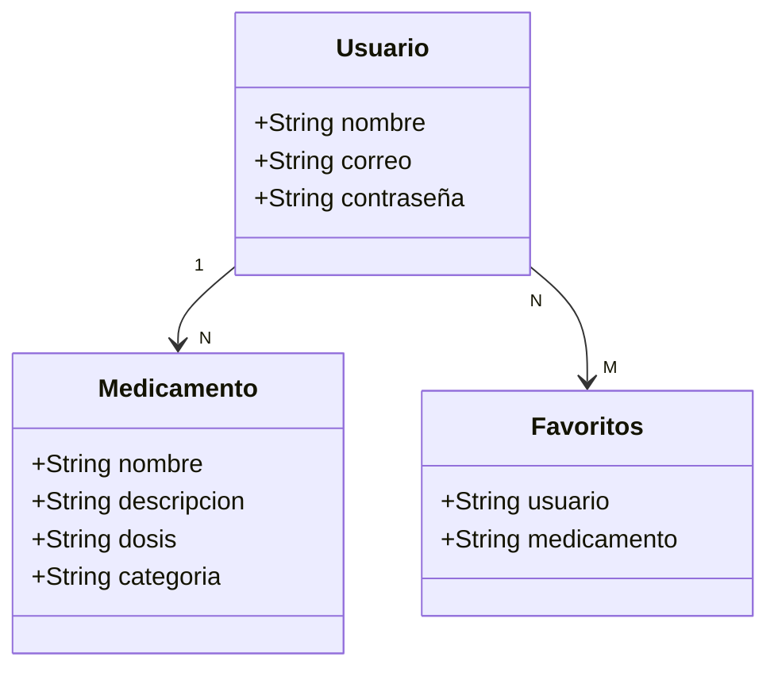

# Manual Técnico — Dosis Segura v1.0

## 1. Descripción del sistema

### Problema que resuelve
Muchas personas tienen dificultades para encontrar
información confiable y organizada sobre medicamentos
como dosis, contraindicaciones y presentaciones
disponibles. Actualmente deben buscar en múltiples
fuentes que no siempre son claras ni accesibles.

### Usuario objetivo
Pacientes, familiares y profesionales de la salud
que necesiten consultar información sobre medicamentos
de forma rápida, clara y confiable desde su dispositivo
Android.

### Alcance del MVP
La aplicación cubre las siguientes funcionalidades:
- Registro e inicio de sesión de usuarios
- Búsqueda de medicamentos por nombre
- Visualización de información detallada de cada
  medicamento
- Gestión de una lista de favoritos personal

La aplicación no incluye venta, pedidos ni entregas
de medicamentos.

---
## 2. Arquitectura de la aplicación

### Diagrama de capas

```text
┌──────────────────────────────────────┐
│               CAPA UI                │
├──────────────────────────────────────┤
│ Activities + Layouts XML             │
│ • LoginActivity                      │
│ • MainActivity                       │
│ • activity_login.xml                 │
│ • activity_main.xml                  │
│ • item_medicamento.xml               │
└──────────────────────────────────────┘
                   │
                   ▼
┌──────────────────────────────────────┐
│            CAPA LÓGICA               │
├──────────────────────────────────────┤
│ • MedicamentoAdapter                 │
│ • Lógica de búsqueda y filtrado      │
└──────────────────────────────────────┘
                   │
                   ▼
┌──────────────────────────────────────┐
│            CAPA DATOS                │
├──────────────────────────────────────┤
│ • ArrayList<Medicamento>             │
│ • Clase modelo: Medicamento          │
└──────────────────────────────────────┘
```
### Descripción de capas

**Capa UI:** Contiene todas las Activities y archivos
XML de diseño. Es responsable de mostrar la información
al usuario y capturar sus interacciones.

**Capa Lógica:** Contiene los Adapters y las clases
que procesan los datos antes de mostrarlos. El
MedicamentoAdapter conecta los datos con la vista
ListView.

**Capa Datos:** Contiene las clases modelo y el
almacenamiento en memoria mediante ArrayList.
Los datos se inicializan en MainActivity y se
pasan al Adapter.

### Patrón de diseño
La aplicación sigue un patrón **MVC simplificado**:
- **Model:** Clase Medicamento
- **View:** Layouts XML
- **Controller:** Activities y Adapters

---

## 3. Modelo de datos

### Diagrama de entidades
## Diagrama de clases


### Descripción de entidades

#### 👤 Usuario

Representa a la persona que utiliza la aplicación y accede a las funcionalidades mediante autenticación.

| Campo | Tipo | Descripción |
|-------|------|-------------|
| nombre | String | Nombre completo del usuario. |
| correo | String | Correo electrónico único utilizado para iniciar sesión. |
| contraseña | String | Contraseña de acceso del usuario. |

#### 💊 Medicamento

Representa la información de cada medicamento disponible en el catálogo de la aplicación.

| Campo | Tipo | Descripción |
|-------|------|-------------|
| nombre | String | Nombre comercial del medicamento. |
| descripcion | String | Descripción general del medicamento. |
| dosis | String | Dosis recomendada de uso. |
| categoria | String | Categoría terapéutica (Analgésicos, Antibióticos, Vitaminas). |

#### ⭐ Favoritos

Representa la relación entre un usuario y los medicamentos que ha marcado como favoritos.

| Campo | Tipo | Descripción |
|-------|------|-------------|
| usuario | String | Correo o identificador del usuario propietario del favorito. |
| medicamento | String | Nombre del medicamento guardado como favorito. |
### Relaciones
- Un usuario puede guardar muchos medicamentos
  en favoritos
- Un medicamento puede ser guardado por muchos
  usuarios en favoritos

---

## 4. Tecnologías y librerías

### Framework principal
| Tecnología | Versión |
|---|---|
| Android Studio | Ladybug 2024.2 o superior |
| Kotlin | 1.9.0 o superior |
| JDK | 17 |
| SDK mínimo | API 24 (Android 7.0) |
| SDK objetivo | API 34 (Android 14) |

### Librerías utilizadas
| Librería | Versión | Uso |
|---|---|---|
| AndroidX AppCompat | 1.6.1 | Compatibilidad con versiones anteriores |
| Material Design | 1.11.0 | Componentes visuales de interfaz |
| AndroidX ConstraintLayout | 2.1.4 | Layouts responsivos |
| AndroidX Core KTX | 1.12.0 | Extensiones Kotlin para Android |

### Herramientas de desarrollo
| Herramienta | Uso |
|---|---|
| GitHub | Control de versiones |
| Figma | Diseño del prototipo |
| Gradle | Gestión de dependencias |

---

## 5. Instrucciones para compilar

### Requisitos previos
- Android Studio Ladybug 2024.2 o superior
- JDK 17 instalado
- SDK de Android API 24 o superior
- Conexión a internet para sincronizar Gradle
- Git instalado

### Pasos para compilar

**Paso 1 — Clonar el repositorio**
```bash
git clone https://github.com/patricioverajavi/dosis-segura.git
```

**Paso 2 — Abrir en Android Studio**
- Abrir Android Studio
- Seleccionar File → Open
- Navegar hasta la carpeta clonada
- Seleccionar la carpeta raíz del proyecto

**Paso 3 — Sincronizar Gradle**
- Esperar que Android Studio detecte el proyecto
- Hacer clic en Sync Now si aparece la notificación
- Esperar que descargue todas las dependencias

**Paso 4 — Ejecutar la aplicación**
- Conectar un dispositivo físico o iniciar un emulador
- Presionar el botón Run o usar Shift + F10
- Seleccionar el dispositivo destino

### Variables de entorno
Esta versión no requiere API keys ni archivos
de configuración externos. Los datos de medicamentos
están incluidos directamente en el código.

---
## 6. Estructura del repositorio

```text
dosis-segura/
├── app/
│   ├── src/
│   │   ├── main/
│   │   │   ├── java/
│   │   │   │   └── com/example/aplicacionmovil/
│   │   │   │       ├── LoginActivity.java
│   │   │   │       ├── MainActivity.java
│   │   │   │       ├── RegistroActivity.java
│   │   │   │       ├── PerfilActivity.java
│   │   │   │       ├── FavoritosActivity.java
│   │   │   │       ├── Medicamento.java
│   │   │   │       ├── MedicamentoAdapter.java
│   │   │   │       ├── MedicamentoRepository.java
│   │   │   │       ├── MedicamentoViewModel.java
│   │   │   │       ├── Usuario.java
│   │   │   │       ├── UsuarioDao.java
│   │   │   │       ├── MedicamentoDao.java
│   │   │   │       ├── RetrofitClient.java
│   │   │   │       ├── NotificationHelper.java
│   │   │   │       └── NotificationWorker.java
│   │   │   ├── res/
│   │   │   │   ├── layout/
│   │   │   │   │   ├── activity_login.xml
│   │   │   │   │   ├── activity_main.xml
│   │   │   │   │   ├── activity_registro.xml
│   │   │   │   │   ├── activity_perfil.xml
│   │   │   │   │   ├── activity_favoritos.xml
│   │   │   │   │   ├── activity_detalle_medicamento.xml
│   │   │   │   │   ├── activity_agregar_medicamento.xml
│   │   │   │   │   └── item_medicamento.xml
│   │   │   │   ├── drawable/
│   │   │   │   ├── mipmap/
│   │   │   │   └── values/
│   │   │   │       ├── colors.xml
│   │   │   │       ├── strings.xml
│   │   │   │       └── themes.xml
│   │   │   └── AndroidManifest.xml
│   └── build.gradle.kts
├── README.md
├── TECHNICAL_MANUAL.md
└── build.gradle.kts
```
### Descripción de carpetas principales

| Carpeta | Contenido |
|---|---|
| java/com/example/aplicacionmovil | Clases Kotlin de la aplicación |
| res/layout | Archivos XML de diseño de pantallas |
| res/drawable | Recursos gráficos y formas XML |
| res/values | Colores, textos y temas de la app |

---

## 7. Historial de versiones

### v1.0 — Julio 2026 — MVP completo

**Funcionalidades implementadas:**
- Login con usuario y contraseña
- Pantalla principal con catálogo de medicamentos
- Búsqueda de medicamentos por nombre
- Visualización de medicamentos por categoría
- Detalle de medicamento con dosis y contraindicaciones
- Guardar medicamentos en lista de favoritos
- Ver lista de favoritos guardados

**Bugs corregidos en v1.0:**
- Categorías de pantalla principal con
  diferenciación visual mejorada
- Ícono de favoritos más visible y descubrible

**Pendiente para v1.1:**
- Sección de medicamentos peligrosos y prohibidos
- Recuperación de contraseña por correo
- Filtros avanzados por categoría terapéutica

---

## 8. Contacto y autoría

| Campo | Información |
|---|---|
| Autor | Patricio Vera |
| Repositorio | https://github.com/patricioverajavi/dosis-segura |
| Versión actual | v1.0 |
| Fecha de entrega | Julio 2026 |
