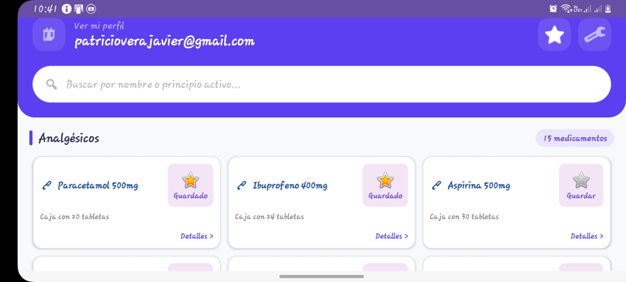
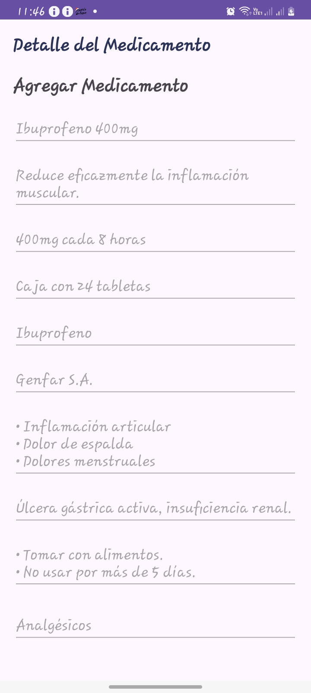

💊 Dosis Segura
> Aplicación Android para consulta de medicamentos de forma rápida, segura y organizada.
---
📋 Descripción del Problema
Muchas personas necesitan consultar información sobre medicamentos (nombre, dosis, categoría, indicaciones y contraindicaciones) pero deben buscar en múltiples fuentes poco confiables o difíciles de entender. Dosis Segura centraliza esta información en una app móvil clara, accesible y fácil de usar.
---
🎯 Objetivo
Diseñar una aplicación Android que permita a los usuarios consultar un catálogo de medicamentos de forma organizada, accesible y visualmente clara, siguiendo los principios de Material Design 3.
---
## 👤 Historias de Usuario — MVP
| # | Historia de Usuario | Prioridad |
| :--- | :--- | :--- |
| HU-01 | Buscar un medicamento por nombre para encontrarlo rápidamente | Alta |
| HU-02 | Filtrar por categoría (Analgésicos, Antibióticos, Vitaminas) | Alta |
| HU-03 | Ver detalle con dosis e indicaciones | Alta |
| HU-04 | Guardar medicamentos en favoritos | Media |
---

## 🛠️ Tecnología Usada
| Tecnología | Uso |
| :--- | :--- |
| Android | Plataforma de desarrollo móvil |
| Material Design 3 | Sistema de diseño de componentes UI |
| Figma | Diseño y prototipado de interfaces |
| Uizard AI | Generación inicial de pantallas con IA |
---

📱 Capturas de Pantalla
Pantalla Login


Pantalla Inicio


Pantalla Detalle


⚙️ Instrucciones de Instalación
Requisitos previos
Android Studio instalado
Android SDK configurado
Dispositivo Android o emulador (API 24 o superior)
Pasos
Clonar el repositorio
```bash
git clone https://github.com/patricioverajavi/dosis-segura.git
```
Abrir el proyecto en Android Studio
Sincronizar las dependencias con Gradle
Ejecutar la aplicación en un emulador o dispositivo físico
---
## 📊 Estado Actual del Proyecto
| Fase                         | Estado       |
|:-----------------------------|:-------------|
| Definición del problema      | ✅ Completado |
| Historias de usuario         | ✅ Completado |
| Paleta de colores y estilos  | ✅ Completado |
| Prototipo en Figma           | ✅ Completado |
| Desarrollo en Android Studio | ✅ Completo   |
| Pruebas Unitarias            | ✅ Completado |
| Publicación                  | ✅ Completo    |
---

## 🎨 Paleta de Colores
| Rol | Color | HEX |
| :--- | :--- | :--- |
| Primario | Verde teal médico | `#006A6A` |
| Secundario | Azul acero suave | `#4A90A4` |
| Fondo | Blanco neutro | `#F5F5F5` |
---

## 💻 Funcionalidades implementadas


### Autenticación
- Login con correo electrónico y contraseña usando Firebase Authentication
- Registro de usuario nuevo con validación de campos
- Acceso como invitado con sesión anónima
- Verificación de sesión activa al abrir la app (no muestra login si ya inició sesión)

### Validaciones
- Campo correo no puede estar vacío
- Formato de correo válido con expresión regular
- Contraseña mínimo 6 caracteres
- Confirmación de contraseña coincide en el registro

### Navegación
- Navegación con FLAG_ACTIVITY_CLEAR_TASK para evitar regresar al login con el botón Atrás
- Redirección automática a pantalla principal si hay sesión activa

### Interfaz
- Diseño con Material Design 3
- TextInputLayout con etiquetas flotantes animadas
- ProgressBar durante el proceso de login
- Mensajes de error en español
- ---
## Pantalla de login


## Pantalla principal


---
## 🐞 Registro de Incidencias (Bugs)

| # | Bug reportado | Fuente | Severidad | Causa raíz | Estado | Commit |
| :--- | :--- | :--- | :--- | :--- | :--- | :--- |
| 1 | Categorías no claras visualmente | Compañero 2 | Media | Sin diferenciación visual entre categorías | ✅ Corregido | fix: categorías con colores diferenciados |
| 2 | Favoritos no se descubren solos | Compañero 1 | Media | Ícono sin etiqueta ni indicación visible | ✅ Corregido | fix: ícono favoritos con etiqueta visible |
| 3 | Falta sección medicamentos peligrosos | Compañero 3 | Media | Funcionalidad no implementada en MVP, diferida a futura | ⏳ Pendiente v1.1 | fix: integración de alertas de seguridad |

---
## 📱 Capturas de Pantalla
| Pantalla Login | Pantalla Principal | Detalle Medicamento |
| :---: | :---: | :---: |
|  |  |  |
---

## 👨‍💻 Autor
Patricio Javier Vera Fernández  
Universidad Central del Ecuador  
Metodología de la Investigación  
*Proyecto académico — 2026*